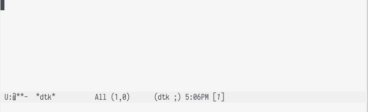

# dtk.el

*Read Biblical texts in Emacs*



---

[diatheke](https://crosswire.org/wiki/Frontends:Diatheke) is a front-end to the [SWORD](www.crosswire.org/sword/) library. **dtk** facilitates reading a Biblical text, or other [diatheke](https://crosswire.org/wiki/Frontends:Diatheke)-accessible material, in Emacs. 


## Getting started

1. Ensure that [diatheke](https://crosswire.org/wiki/Frontends:Diatheke) is installed. In Debian, it is available as the `diatheke` package.

2. Ensure that at least one text accessible as a diatheke module is installed. One way to do this is by using the 'module manager' of [Xiphos](http://xiphos.org/). A number of texts are also available in Debian as packages (e.g., `sword-text-kjv`).

## Usage

*Prerequisites*: Define the variables `dtk-module-category` (default: `"Biblical
Texts"`) and `dtk-module` (default: the first module returned by `diatheke`).
These may be set interactively by calling `dtk-select-module-category` and
`dtk-select-module`, respectively.

<kbd>M-x</kbd> `dtk` will create a dedicated buffer `*dtk*` and prompt for
completion of book, chapter and verse. Corresponding text(s) will be inserted to
`*dtk*` upon completion. 

The `*dtk*` buffer enables `dtk-mode` and provides the following keybindings:

| Key   | Commands                     | Description                                                                    |
|-------|------------------------------|--------------------------------------------------------------------------------|
| g     | `dtk-go-to`                  | Prompt and insert new text                                                     |
| f     | `dtk-forward-verse`          | Forward verse                                                                  |
| b     | `dtk-backward-verse`         | Backward verse                                                                 |
| c     | `dtk-clear-dtk-buffer`       | Clear dtk buffer                                                               |
| M     | `dtk-select-module-category` | Select type of text (Bible text, Commentaries, Dictionaries..)                 |
| m     | `dtk-select-module`          | Select module (Bible versions)                                                 |
| s     | `dtk-search`                 | Search text                                                                    |
| S     | `dtk-show-dict-entry`        | Show Strong's dictionary data for word at point                                |
| q     | `dtk-quit`                   | Quit buffer                                                                    |
| x     | `dtk-follow`                 | Insert the corresponding verse into dtk buffer if point is under full citation |
| C-M-b | `dtk-backward-chapter`       | Move point to previous chapter                                                 |
| C-M-f | `dtk-forward-chapter`        | Move point to next chapter                                                     |

To insert Biblical text directly in any buffer, use <mbd>M-x</kbd> `dtk-bible`.
Call with prefix argument (`C-u`) to temporarily change module when inserting
text.

An example `use-package` configuration:

```emacs-lisp
(use-package dtk
  :bind (("C-c B" . dtk-bible))
  :custom
  (dtk-default-module "KJV")
  (dtk-default-module-category "Biblical Texts")
  (dtk-word-wrap t)
  )
```

## Performing a dictionary lookup

Some texts have dictionary references embedded in the texts. For these texts, dictionary lookups may be available. By default, <kbd>S</kbd> will, by invoking `dtk-show-dict-entry`, display the related dictionary entry, if that entry is available.

### Searching within a text

Search the selected text with <kbd>M-x</kbd> `dtk-search`.


### Selecting a module

Modules fall into a number of categories. Select the category of module which is under consideration with <kbd>M-x</kbd> `dtk-select-module-category`. By default, this functionality is bound to <kbd>M</kbd>.

Select the module of interest (e.g., KJV, ESV, or RNKJV) with <kbd>M-x</kbd> `dtk-select-module`. By default, this functionality is bound to <kbd>m</kbd>.


## See also

[diatheke.el](https://github.com/JasonFruit/diatheke.el) is another interface to diatheke.

[sword-converter](https://github.com/alphapapa/sword-converter) converts SWORD module content to JSON and SQLite. Provides search functionality.

[sword-to-org](https://github.com/alphapapa/sword-to-org) converts SWORD modules content to org outlines.
